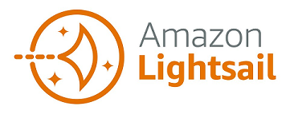

# Amazon Lightsail

Amazon Lightsail is a service that lets you spin up managed service quickly with a shell script.

[https://aws.amazon.com/lightsail/](https://aws.amazon.com/lightsail/)



## Setting up a Server

First login to your Amazon Lightsail account and create an instance

**Instance Settings**

These are the insance settings that are working. Your mileage may vary for something not indicated in this list.

* Select OS Only
* Ubuntu 18.04
* Add Launch Script \(script below\)
* Select 1GB - $5 plan.
* Assign a name to your instance under "Identify Your Instance"

**That's basically it for settings!**

Now before you click create, you'll need the following template to get your site working on Amazon Lightsail. You only get one shot at this when it initializes. You can't do this later.

**Commandbox Template**

Full script at the end but here is the play by play

**1. Install Java**

Commandbox needs Java to run

```bash
# They try to ship out Ubuntu as light as possible so you'll want to run this first to get all the latest repo information
sudo apt-get update
# install java for commandbox
yes | sudo apt-get install default-jre
```

**2. Install Commandbox**

This is taken directly from \([https://commandbox.ortusbooks.com/setup/installation](https://commandbox.ortusbooks.com/setup/installation)\)

```bash
#taken straight from ortus docs commandbox install
curl -fsSl https://downloads.ortussolutions.com/debs/gpg | sudo apt-key add -
echo "deb http://downloads.ortussolutions.com/debs/noarch /" | sudo tee -a /etc/apt/sources.list.d/commandbox.list
sudo apt-get update && sudo apt-get install commandbox
```

**3. Download your code/repo**

In this template, we are using Ortus' awesome Github repo with Elixir and Vue.js. There are other ways like copying over from a local file with SSH or use a disk that you created in Amazon Lightsail that will persist even if the instance is delete. Notice here that we saved it to the `/app` directory. Note that for later when you run your app, to navigate to it.

```bash
sudo git clone https://github.com/coldbox-templates/elixir-vuejs.git /app
```

**4. Install any dependencies**

For example you can run your box dependencies or if you are using webpack, this would be the time to get all that compiled.

```bash
cd /app && sudo box install
```

**5. Run the server**

In here we start the server in the `/app` directory. We set the host to `0.0.0.0` so that it listens on any interface/hostname assigned to it. Also, we define the port `80` so that it's not some random port generated by commandbox. Long story short, when this thing runs, we know all we need to do is hit the IP address that Amazon Lightsail assigned to it.

```bash
cd /app && sudo box start --debug host=0.0.0.0 port=80
```

#### Final script

```bash
sudo apt-get update
#install java for commandbox
yes | sudo apt-get install default-jre

#taken straight from ortus docs commandbox install
curl -fsSl https://downloads.ortussolutions.com/debs/gpg | sudo apt-key add -
echo "deb http://downloads.ortussolutions.com/debs/noarch /" | sudo tee -a /etc/apt/sources.list.d/commandbox.list
sudo apt-get update && sudo apt-get install commandbox

#might need this later for webpack
yes | sudo apt install npm
#clone your repo to the /app directory, just like Ortus does
sudo git clone https://github.com/coldbox-templates/elixir-vuejs.git /app

#start server and expose it to the world
cd /app && sudo box install
sudo box start --debug host=0.0.0.0 port=80
```

#### That's it

All you have to do is create your instance. It will boot up and when it is finally running, you should have a _**Public IP**_ address assigned to it...But don't be in to big of a hurry. With these settings, it takes about 4 minutes and 30 seconds before Commandbox is serving something. Wait for it and enjoy!

